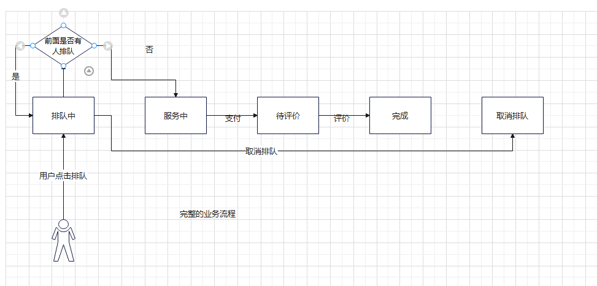
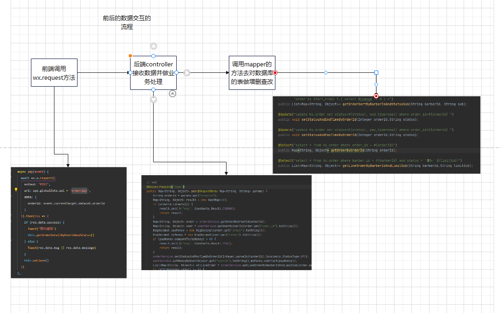

# 毕设

## 简介

### 技术栈

1. 前端 微信小程序

2. 后端 springboot springmvc mybatis 

3. 包管理工具 maven

4. 数据库 mysql

   

## 前端

### 模块划分

1. 首页
2. 剪发
3. 订单
4. 我的

### 组件

1. vant
2. promise
3. mobx

#### promise

解决微信小程序网络请求方法回调地狱、可读性差的问题

## 后端

### 代码风格

1. controller 
2. service
3. mapper
4. domain
5. bean
6. config
7. util

### 模块划分

1. app 页面配置及其相关的数据
2. barber 理发师相关
3. evaluate 评价相关
4. file 文件上传下载
5. order 订单
6. user 用户

### constants类

定义了公共常量

### user

## 业务逻辑

### 登录注册

权限分类  

1. 游客  只用微信登录 没有点注册登录按钮（数据库没有插入用户数据）
2. vip  注册登录（获取微信用户的手机号码并解密，插入用户数据）
3. 管理员  

业务逻辑

微信登录获取code 调用接口换取 openid、unionid、session_key 等信息

1. 微信登录 获取code   
2. 注册登录 调用接口换取 openid、unionid、session_key 等信息，解密手机号码
3. 把手机号码 微信昵称 头像 传到后端 
4. 通过手机号码查询是否已注册 是则直接返回用户数据，否则插入数据在返回用户数据

### 功能菜单

我的信息

图标 image/myinfo    

xxx,png 未被选中  xxx-active.png 被选中的样式

修改数据  myinfo.js  steps - options

### 理发师管理

对理发师信息增删查改

### 用户管理

查看会员信息

### 页面配置

1. 修改小程序的页面配置相关的静态资源 不用修改代码就能实现对页面的样式的管理
2. 价格配置 可以灵活的对价格进行修改（过年涨价之类的） 理发价格=基础收费 + 手艺收费

### 匹配理发师

1. barber.is_work = 是  在职
2. barber.star_time  < sysdate < barber.end_time  是否在工作时间内
3. 默认理发项目是洗剪吹  根据理发师能做的项目匹配理发师，比如发型设计只有总监能做，染发只有总监和高级发型师能做，烫发只有总监、高级、中级，洗剪吹都能做 在Constants类的SkillSub配置

工作时长规则 根据入职时间（新增理发师信息的时间）和当前时间做比较，不满一年按一年计算

### 地图找店

map.js 全局搜索23.099994（经度） 113.324520（维度）一键替换

### 排队

1. 判断是否登录 未登录 跳转登录界面
2. 判断是否在工作时间内 （防止出现页面长时间不刷新导致理发师下班了，还能发起订单的情况）
3. 判断是否有订单正在进行中  有  提示 你有订单正在进行中
4. 往order(订单表)插入数据
5. 判断理发师是否有其他订单 无 直接把状态改成 “服务中”

### 订单

画图表示订单的流程

五个状态 排队中->服务中->待评价->已完成   取消排队

### 支付

1. 通过orderId改订单状态和支付时间
2. 根据barberId查询后面所有的排队订单（根据订单创建时间排序）
3. 订单有数据 把第一个正在排队的订单状态改成服务中

### 文件上传下载

1. 微信小程序文件上传到微信服务器的临时文件夹

2. 我们用微信的getFileSystemManager把文件转成base64格式以参数的形式发给后端

3. 后端BASE64DecodedMultipartFile类把base64转MultipartFile然后下载到D:/IDEAProjects/hs/src/main/resources/static/目录下

   

### 图解

